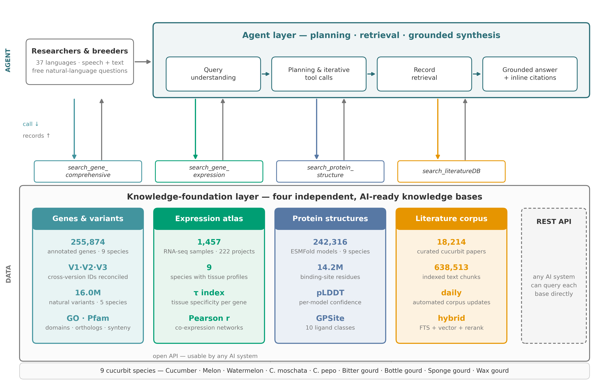

# CucurbitAgent

**An evidence-grounded, tool-calling AI agent for multi-omics research in cucurbit biology.**

CucurbitAgent answers natural-language research questions about cucumber, watermelon,
melon, pumpkin, and the other cultivated Cucurbitaceae by orchestrating four independent
evidence modules — **Genes**, **Expression**, **Protein structures**, and **Literature** —
inside a ReAct-style tool-calling loop. Every answer is anchored to a checkable record:
a gene entry, an expression value, a structural residue, or a literature passage with a DOI.



- Live platform: **https://cuagent.com**
- Knowledge base: 9 cucurbit genomes, ~256,000 genes, 16.0 M natural variants,
  ~242,000 ESMFold structures with GPSite binding-site annotations, and a curated
  corpus of 18,000+ cucurbit publications
- Interface: 37 languages, text in / text out
- Benchmark: **CucurbitBench**, 50 expert-authored items across 8 capability axes
  (96.0% weighted win rate over nine general-purpose LLMs under blinded review)

## Repository layout

```
CucurbitAgent/
├── api/                 FastAPI backend
│   ├── app/routes/      module endpoints: genes, expression, proteins,
│   │                    literature, agent, auth, feedback, ...
│   ├── app/services/    module logic: retrieval, RAG, co-expression,
│   │                    rate limiting, analytics, ...
│   ├── app/config.py    all settings resolve from environment variables
│   ├── tests/           unit tests
│   └── Dockerfile
├── web/                 Next.js front end (37-language UI, SSE streaming,
│   │                    gene cards, expression charts, protein viewer)
├── scripts/             data-pipeline utilities (PubMed fetch, Pfam/ESMFold helpers)
├── infrastructure/      nginx + systemd templates for production deployment
├── content/             i18n site copy
├── data/
│   ├── cucurbench/      the CucurbitBench 50-item set
│   ├── examples/        small example data files
│   └── README.md        how to obtain / rebuild the full science data
└── docs/                documentation and figures
```

## Quickstart (local development)

Prerequisites: Python 3.10+, Node.js 18+.

```bash
git clone https://github.com/sevencheung2021/CucurbitAgent.git
cd CucurbitAgent

# 1. backend
cd api
python -m venv .venv && source .venv/bin/activate
pip install -r requirements.txt
cd ..

# 2. frontend
cd web
npm install
cd ..

# 3. configure
cp .env.example .env        # then edit: LLM key, data root

# 4. run
uvicorn api.app.main:app --reload --port 8000   # backend
cd web && npm run dev                           # frontend → http://localhost:3000
```

Without a full science database configured, the platform still starts; the agent and
module endpoints that require data will return clear errors until you mount a data root
(see below). All LLM endpoints require `ZHIPU_API_KEY` (any OpenAI-compatible provider).

## Configuration

Everything is configured through environment variables — see [`.env.example`](.env.example)
for the complete annotated list. The most important ones:

| Variable | Meaning |
|---|---|
| `ZHIPU_API_KEY` / `ZHIPU_BASE_URL` / `ZHIPU_MODEL` | any OpenAI-compatible LLM backend |
| `CUAGENT_DATA_ROOT` | root directory of the science databases |
| `CUAGENT_ADMIN_TOKEN` | secret for admin endpoints |
| `CUAGENT_CORS_ORIGINS` | allowed browser origins in production |

## Science data

The full knowledge base (genomes, variants, ESMFold structures, literature index)
is **not** bundled with the code — it is ~100 GB. The repository ships the
[CucurbitBench item set](data/cucurbench/) and [small examples](data/examples/);
[`data/README.md`](data/README.md) documents the on-disk layout, the public sources
of every layer, and the scripts that rebuild it.

## Reusing the framework for another crop

The architecture is crop-agnostic by design:

1. **Build the evidence modules** — one SQLite/TSV knowledge base per data type,
   following the layout in `data/README.md`.
2. **Point `CUAGENT_DATA_ROOT` at it** — no code changes are needed for the
   retrieval paths.
3. **Swap the domain gate** — adapt the module prompt guards in
   `api/app/services/` to your crop vocabulary.

If you reuse the framework, please cite this work (see below).

## License

Code is released under the [MIT License](LICENSE).
CucurbitBench items are released for research use; attribution is appreciated.

## Citation

A manuscript describing CucurbitAgent is under review. Until publication, please
cite the platform:

> Zhang, R., Zhang, J., Zhang, Y., et al. CucurbitAgent: an AI agent for
> multi-omics research in cucurbit biology. https://cuagent.com (2026).
